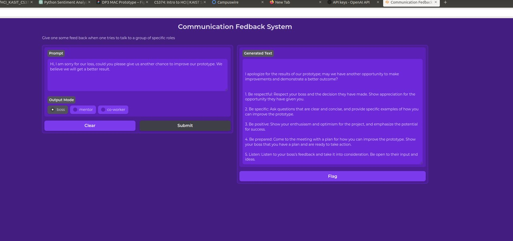

# Basic Target
- Chat Suggestion
- Sentiment Analysis

# Chat Suggestion
We have three modes, boss, mentor, co-worker
You can create a virtual environment at least at python 3.7 to run following code
```
pip install openai
pip install gradio
python gradio_test.py
```
- Result

<p align="center">
  
</p>
